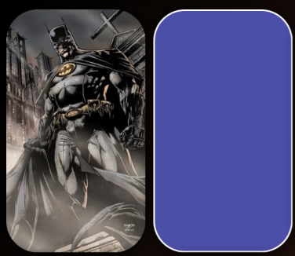
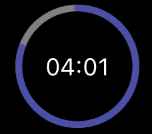
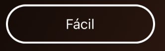
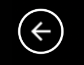

Here are some GIFs where you can see the design and behavior of the app. And I also inform you of the most outstanding details of the application and possible future improvements.

## Preview
--------------------

### Platforms
----------
*   **iOS**
*   **Android**

It works only in portrait mode

## Running in my computer
----------

It is necessary a version of visual studio intallation, compatible with dotnet maui. And the tools to deploy on the desired platform (Xcode, Android SDK...)
Note that at the time of writing this document some nuget packages were in pre-release, so it may be necessary to activate that check in the nuget package manager.

## Nugets
----------

*   **ReactiveUI.Maui:** As in other applications that I have developed, I have used this _nuget_ to create the base classes from which both my graphic elements and their _ViewModel_ hang. I feel very comfortable working with him. I think it simplifies development a lot without penalizing performance and giving me the control to free up memory used by certain resources, like _bindings_, event subscriptions, observables...
*   **ReactiveUI.Fody:** I use it to save some code when working with _RxUI_.
*   **SkiaSharp.Views.Maui.Controls**: I have used it to draw the control that shows the progress of the time consumed once the game has started.
*   **SkiaSharp.Extended.UI.Maui:** _skia sharp_ extension that allows to play _lottie_ animations.

## Base classes
-----------

I like to have some base classes, from which the rest inherit and offers some common functionality.

*   **BaseContentPage**
    *   Manage activation / deactivation with _RxUI_, to dispose resources when they are no longer needed.
    *   Notifies the _ViewModel_ when the page appears and disappears. Useful to respond from the _ViewModel_ to these actions.
     * Controls the pressing of the _back button_ on Android.
     * Execute appearance and disappearance page animations, to achieve very successful effects in the navigation from one page to another.
*   **BaseContentView**
    *   All it has are methods for adding disposable elements to the collection of the _ContentPage_ it's in.
*   **BasePopup**
    *   It's a _BaseContentPage_ with a popup appearance. In _Xamarin_ I used _RxPopup_, but it is not available in _dotnet MAUI_ (at least at the time of writing this post) and with the _CommunityTool_Kit popup I had some problems on Android (I repeat, all this at the time of writing this post)
*   _**BaseViewModel**_
    *   Handle activation/deactivation with _RxUI_, to dispose resources when they are no longer needed.
     * Implement the back navigation _command_.

## Services
---------

In the services I add all that transversal functionality to the application and that would generate coupling if it were included in the base classes.

*   **DialogService**
     * I use it to show info, confirmation dialogs and action sheets.
* **LogService**
     * Service that allows me to leave traces. In this application I only write diagnostic information, but it could be integrated with _AppCenter, Crashlytics, Application insights..._
* **NavigationService**
     * Although I use a shell, I like to encapsulate the navigation functionalities in a service to be able to perform specific actions of the navigation.

## Controls
---------

I like to create custom controls to simplify my pages and in order to reuse them. There are times when styles and templates are not enough, that is why I have created the following controls.

Note that to make these controls more attractive, I have used new features of _dotnet MAUI_, which simplify the design, such as _borders_ and _shadows_. Likewise, in the case of the _CircleProgressBar_ I have used _skia_ to draw the control.

## Features
--------

Most of the application's functionality is housed here, in _ContentPages_ and _ViewModels_. I will not go into detail to explain everything I have done here, but I will expose some interesting points or that may cause some confusion.

All pages have a background gradient, which is achieved very easily using _LinearGradientBrush_.

In all _ContentPage_ methods have been implemented to perform animations when a page is opened and when it disappears.

* **ThemeSelector**: Initial page in which the theme is selected. _CardButtons_ are used to display the distinct buttons.
* **LevelSelector**: Similar to the previous one, but instead of using _CardButtons_, _CustomButtons_ have been used.
* **Game**: Depending on the level selected, board is created with different sizes and the user is given more or less time to discover all the images. These images vary depending on the chosen theme. NOTE: In the _FillGridBoard_ method of the page, you can see that the cards are discovered when different events are fired on iOS and Android. It has been done this way because what worked on one platform did not work on the other.
* **GameOver**: Popup that shows a _lottie_ animation and a text, depending on whether the user has revealed all the cards or the time has run out.

## Navigation
----------

Navigation is done via _shell_. Parameter are send also with _shell_ functionalities. In addition, it is the navigation service that, before leaving a page, launches the animation of its disappearance, taking into account that all pages implement the _IAnimatePage_ interface.

There is a point that should be highlighted in the navigation. From _GamePage_ the _popup_ is opened as a modal showing the game is over. Closing that _popup_, instead of navigating back closing the modal and displaying again the previous _GamePage_, it navigates to a new instance of _GamePage_ and clears the old one from the navigation stack. Why have I done this? Because when it navigates to the modal, _OnDisappearing_ is fired, performing the page and _ViewModel_ deactivation, but when it navigates back from the modal, _OnAppearing_ is not fired and therefore the page activation is not performed, so _bindings_, _observables_, subscriptions to events... don't work

## More details
------------

It is interesting to talk about certain details that I have used.

* **MauiAppBuilder:** for building pages, _ViewModels_, and dependency resolution and injection.
* **FontIcons:** to display the images of the _back_ and _close_ buttons.
* **Text resources:** In English and Spanish, using the system language.
* **Images in common project:** So it is not necessary to add images on different platforms. Although the ideal would have been use _svg_ as image format.
* **MAUI icon and splash:** defined in the _csproj_, without the need to do anything in the platform code.
* **Light and Dark Mode:** All colors are defined with both modes in mind.

## Future improvements
------------------

There are certain improvements that I have left for later. Here I talk about some of them, although I'm sure there are more. There is always something to improve.

* Adapt the views to desktop and horizontal position.
* Add tests.
* Save scores to make a classification with the best times by levels.
* Images in _svg_.
* Traces in _AppCenter_ (or similar).
